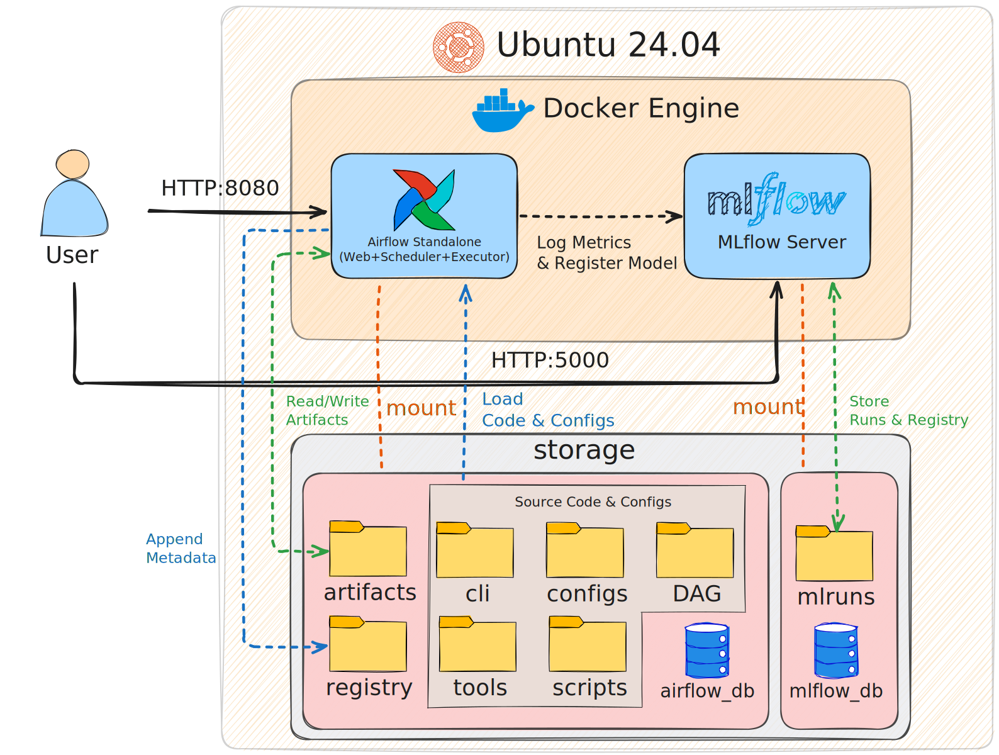

# Continuous Training (CT) Pipeline 자동화

## 1. Overview

본 프로젝트는 FashionMNIST 데이터셋을 대상으로 **snapshot → train → eval → gate → register** 전 과정을 **원클릭으로 자동 실행**하는 Continuous Training(CT) 파이프라인을 구현합니다.

* Models

  * Baseline model (pretrained 미사용)
  * ResNet34 (ImageNet pretrained)
  * EfficientNet-B0 (ImageNet pretrained)
* Automation

  * Makefile + CLI 기반 원클릭 실행
  * Airflow DAG 기반 자동화
* Registry

  * 릴리즈 게이트를 통과한 모델만 메타데이터 등록
  * MLflow Model Registry 사용

---

## 2. Environment & Requirements

* OS: Ubuntu 24.04.3 LTS
* Python: 3.12.3
* Device: CPU (CUDA 미사용)
* Docker: 29.1.3, build f52814d
* Docker Compose: v5.0.0
* Airflow image: ghcr.io/mlflow/mlflow:v3.7.0
* MLflow image: apache/airflow:3.1.5-python3.12

---

## 3. Environment Setup
>⚠️ 본 프로젝트의 모든 명령어 및 작업은 airflow-mlflow-mlops-ct-pipeline 디렉토리 기준으로 수행됩니다.
>아래 단계에 따라 먼저 프로젝트 루트 디렉토리로 이동해주세요.
```bash
cd airflow-mlflow-mlops-ct-pipeline
```
### Python venv setup

```bash
# venv 사용 권장
sudo apt install python3.12-venv
python3 -m venv .venv
source .venv/bin/activate
```

### pip 패키지 설치
```bash
pip install pandas scikit-learn pyyaml mlflow click tqdm
pip install torch torchvision --index-url https://download.pytorch.org/whl/cpu

# 설치 확인
python -c "import torch; print(f'Torch: {torch.__version__}')"
python -c "import sklearn; print('Scikit-learn OK')"
```

### Directory initialization & permissions

```bash
# Airflow 및 MLflow 컨테이너 실행 시 권한 이슈를 방지
mkdir -p airflow_db mlflow_db mlruns
sudo chown -R 50000:0 airflow_db
sudo chmod -R 777 airflow_db mlflow_db mlruns artifacts registry
```


---

## 4. One-click Execution

### 전체 파이프라인 실행

```bash
make run
```

`make run` 명령 하나로 **전체 Continuous Training 파이프라인이 실행**됩니다.  
실행은 Airflow를 통해 백그라운드에서 이루어지며, 사용자는 별도의 단계별 명령을 직접 호출할 필요가 없습니다.

파이프라인의 실행 과정, 태스크 상태, 모델별 PASS/FAIL 분기 흐름은 Airflow Web UI (http://localhost:8080)에서 실시간으로 확인할 수 있습니다.

이 과정에서 Makefile은 다음 역할을 담당합니다.

1. Docker Compose를 통해 Airflow 및 MLflow 서비스를 실행
2. Airflow Webserver가 요청을 받을 수 있는 상태가 될 때까지 대기
3. CT 파이프라인 DAG를 트리거


DAG가 트리거되면, 이후의 학습·평가·릴리즈 판정·등록 과정은 Airflow 파이프라인 내부에서 자동으로 수행됩니다.
Airflow DAG의 태스크 구성과 의존성에 대한 자세한 설명은 **Pipeline Design** 섹션에서 다룹니다.

---
## 5. Technology Stack


### **Core Components**

- Local(**WSL2**)에서 개발 / Cloud(**EC2**)에서 동작 검증
- **Docker Compose** 기반 컨테이너 구성
- **Apache Airflow** (DAG 기반 CT 파이프라인 오케스트레이션)
- **MLflow** (실험 결과 추적 및 PASS 모델 Registry 등록)
- **SQLite** *(Airflow 메타데이터 및 MLflow Tracking/Registry 백엔드 저장소)*
---

## 6. System Architecture


> **Airflow를 중심으로 Continuous Training 파이프라인을 실행**하고, 파이프라인 실행 과정에서 생성되는 **학습 결과 및 메타데이터를 MLflow에 기록**하는 구조입니다.

### 6.1 Execution Flow

* DAG를 실행하며 `Snapshot → Train → Eval → Gate → Register` 전 과정을 오케스트레이션합니다.
* 각 태스크 실행 중, **릴리즈 게이트를 통과한 모델만 MLflow Server**에 메트릭 및 모델을 등록합니다.

### 6.2 Service Access

사용자가 각 서비스에 직접 접근할 때 사용하는 URL은 다음과 같습니다.

| Service | URL | Note |
| :--- | :--- | :--- |
| **Airflow Web UI** | `http://localhost:8080` | DAG 관리 및 로그 확인 |
| **MLflow UI / API** | `http://localhost:5000` | 실험 추적 및 모델 레지스트리 |

### 6.3 Storage & Volume Mount Strategy

>시스템은 Docker 기반으로 구성되며, 각 컨테이너는 **역할에 따라 분리된 스토리지를 마운트**하도록 설계되었습니다.
(아키텍처 다이어그램의 주황색 점선 영역 참조)

#### 6.3.1. Airflow Container Mount (Left Side)
Airflow 컨테이너는 **좌측 스토리지 영역(분홍색 박스)**을 마운트합니다.

* **Code & Config (Read)**
    * `cli`, `configs`, `DAG`, `tools`, `scripts`
    * DAG 실행을 위한 코드 및 설정 파일 Read
* **Artifacts (Read / Write)**
    * 데이터 스냅샷, 모델별 학습 결과 및 체크포인트 저장
    * 평가 단계에서 체크포인트를 다시 로드할 때 Read
* **Registry (Write)**
    * 릴리즈 게이트를 통과한 모델의 메타데이터를 `registry/metadata.jsonl` 파일에 **append 방식으로 기록**

#### 6.3.2. MLflow Container Mount (Right Side)
MLflow 컨테이너는 **우측 스토리지 영역(분홍색 박스)**을 마운트합니다.

* **mlruns (Read / Write)**
    * 실험 메트릭, 파라미터, 아티팩트 기록
    * Model Registry 정보 저장 및 조회

---

## 7. Pipeline Design

본 CT 파이프라인은 **dataset snapshot을 1회 수행한 후**, 각 모델에 대해 학습부터 등록까지의 CT 사이클을 **순차적으로 실행**하는 구조로 설계되었습니다.

```text
data_snapshot (once)

  → baseline
      train → eval → gate → branch_register
                            ├─ PASS → register → join
                            └─ FAIL → skip_register → join

  → resnet34
      train → eval → gate → branch_register
                            ├─ PASS → register → join
                            └─ FAIL → skip_register → join

  → efficientnet_b0
      train → eval → gate → branch_register
                            ├─ PASS → register → join
                            └─ FAIL → skip_register → join
```
아래는 실제 Airflow UI에서 확인한 DAG 실행 화면입니다.


* data_snapshot 태스크는 전체 파이프라인에서 한 번만 실행됩니다.
* 각 모델은 독립적인 TaskGroup으로 구성되어 동일한 CT 흐름을 따릅니다.
* gate 결과에 따라 register 또는 skip_register로 분기되며, FAIL 모델이 존재하더라도 전체 DAG는 중단되지 않고 다음 모델로 진행됩니다.
* 분기 제어는 branch_register 태스크를 통해 수행되며, gate 태스크의 결과(PASS / FAIL)를 전달받아 이후 실행 경로를 결정합니다.

---

## 8. Dataset Snapshot & Reproducibility

* Dataset: FashionMNIST (torchvision 제공 train / test)
* Train / Validation split:
  * Random seed 고정: seed = 42
* Dataset tag:
  * 저장 경로: [`artifacts/dataset_tag.txt`](artifacts/dataset_tag.txt) 
  * 기록 값: mnist_v1_seed42

---

## 9. Evaluation Metrics

* **Top-1 Accuracy**
* **Average F1-score**
  * Cutoff는 validation set에서 Youden Index를 기반으로 계산하였으며, 다중 분류 특성을 고려해 메타데이터 기록 용도로만 사용하였습니다.
  * 계산된 cutoff 값은 `artifacts/{model}/eval.json`에 함께 기록됩니다.
* **Inference latency p95**

---

## 10. Release Gate Policy

### Release gate criteria

- Top-1 Accuracy ≥ **0.92**
- Avg F1-score ≥ **0.90**
- p95 latency ≤ **20 ms**

릴리즈 게이트는 각 모델의 평가 결과에 대해 자동으로 **PASS / FAIL**을 판정합니다.
FAIL인 경우, **Airflow의 `gate` 태스크 단계에서 미통과 사유가 로그로 출력**되며, 해당 모델은 registry 단계에서 제외됩니다.
출력 예시는 다음과 같습니다.
```text
FAIL: [Info] baseline failed release gate. Reasons: Low Accuracy (0.8432 < 0.9), Low F1 Score (0.8430 < 0.9)
```

---

## 11. Results Summary

| Model           | Acc    | Avg-F1 | p95(ms)| Gate | Reason              |
| --------------- | ------ | ------ | -------| ---- | --------------------|
| Baseline        | 0.8432 | 0.8430 | 0.99   | FAIL | acc/avg-f1 조건 미달 |
| ResNet34        | 0.9449 | 0.9453 | 19.15  | PASS | 모든 조건 충족       |
| EfficientNet-B0 | 0.9498 | 0.9494 | 15.46  | PASS | 모든 조건 충족       |

---

## 12. Model Registry

릴리즈 게이트를 **PASS**한 모델만 레지스트리에 등록하며, 아래는 실험 수행 후 확인된 모델 레지스트리 등록 결과입니다.

- Registry metadata: [`registry/metadata.jsonl`](registry/metadata.jsonl)  
  - 릴리즈 게이트를 통과한 모델에 대해서만 메타데이터가 append 방식으로 기록됩니다.

또한, 본 파이프라인에서는 **MLflow Model Registry**를 사용하여 PASS 모델을 **staging 단계로 등록**하였습니다.
MLflow Tracking Server 및 Model Registry UI는 http://localhost:5000에서 확인할 수 있습니다.

아래 이미지는 MLflow Model Registry에 등록된 모델 목록을 보여줍니다.


>💡 **Note**  
이미지에 포함된 `fashion_mnist_baseline` 모델은 레지스트리 등록 로직 검증을 위해 **임계값을 일시적으로 낮춰 테스트한 결과**이며, 
실제 릴리즈 게이트 정책에서는 **FAIL 처리되는 모델**입니다.

---

### 참고

Experiments 내 **Runs / Models 및 각 run의 세부 메타데이터**는 아래 MLflow UI 스크린샷을 참고해주세요.

- Experiments / Models 목록: [registry/mlflow_models.png](registry/mlflow_models.png)
- Experiments / Runs 목록: [registry/mlflow_runs.png](registry/mlflow_runs.png)
- Run 상세 화면: [registry/mlflow_detail.png](registry/mlflow_detail.png)


---


## 13. Project Structure

```text
airflow-mlflow-mlops-ct-pipeline/
├── artifacts/
│   ├── dataset_tag.txt
│   └── {model}/
│       ├── model.pt
│       └── eval.json
├── cli/
│   └── ct.py
├── configs/
│   └── run.yaml
├── DAG/
│   └── CT.py
├── registry/
│   └── metadata.jsonl
├── scripts/
│   ├── data_snapshot.py
│   ├── train.py
│   └── eval.py
├── tools/
│   ├── release_mlflow.py
│   └── register_gate.py
├── Airflow_setup.md
├── baseline.json
├── Docker-compose.airflow.yml
├── Makefile
├── README.md
└── requirements.txt
```